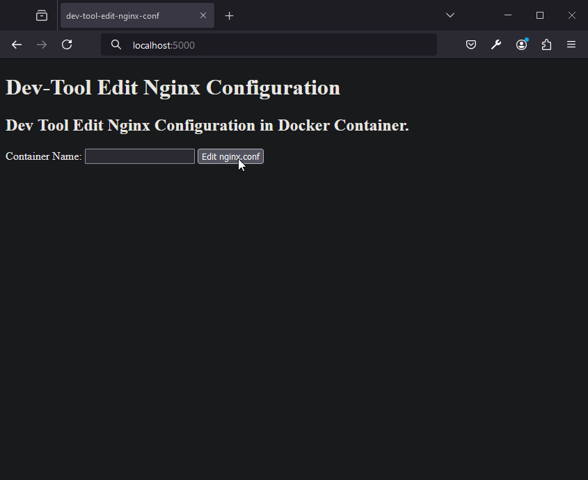

# Dev Tool Edit Nginx Configuration in Docker Container

🌍 *[Português](README.md) ∙ [English](README_en.md)*

## Descrição
Este projeto é uma ferramenta de desenvolvimento para editar arquivos de configuração do Nginx em containers Docker. Permite aos usuários especificar o nome do container e editar o arquivo `nginx.conf` diretamente através de uma interface web.

---

## Instalação
Siga estas etapas para instalar o projeto:

## Pré-requisitos

Certifique-se de ter o Python e o Docker instalados no seu sistema.

```bash
pip install Flask
```

## Como Executar

1. Instale as dependências:

```bash
pip install -r requirements.txt
```

2. Execute o aplicativo Flask:

```bash
python app.py
```

O aplicativo estará disponível em http://localhost:5000/.

## Uso

1. Acesse http://localhost:5000/ no seu navegador.
2. Clique em "Edit nginx.conf".
3. Insira o caminho do arquivo (por exemplo, `/etc/nginx/nginx.conf`).
4. Modifique o conteúdo do arquivo conforme necessário.
5. Clique em "Registrar" para salvar as alterações no arquivo e reiniciar o container.



---

## Notas Importantes

- Este projeto é destinado apenas para fins de desenvolvimento local.
- **Atenção**: Não use esta ferramenta em ambientes de produção. Modificar arquivos diretamente em um contêiner em ambiente de produção é uma prática arriscada e pode levar a comportamentos inesperados e vulnerabilidades de segurança.

---

## Licença

Este projeto está licenciado sob a licença MIT - consulte o arquivo [LICENSE](LICENSE) para obter detalhes.

---

## Contribuição
Contribuições são sempre bem-vindas! Para contribuir:

1. Faça um fork do projeto.
2. Crie uma nova branch para suas modificações (`git checkout -b feature/AmazingFeature`).
3. Faça commit de suas alterações (`git commit -m 'Add some AmazingFeature'`).
4. Faça push para a branch (`git push origin feature/AmazingFeature`).
5. Abra um Pull Request.

---