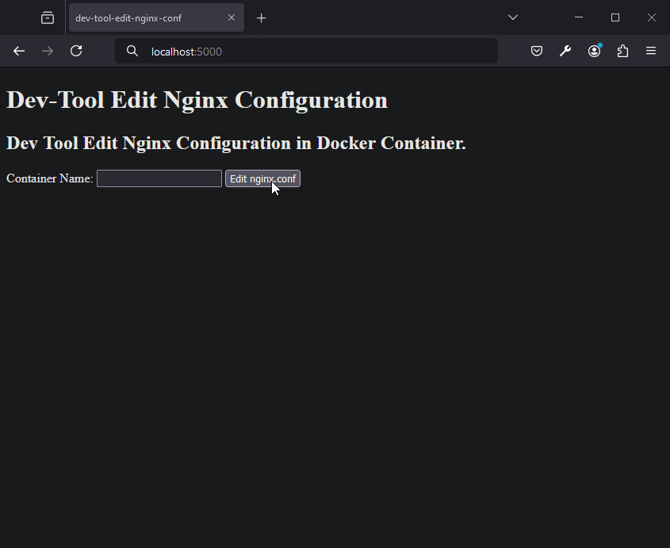

# Dev Tool Edit Nginx Configuration in Docker Container

🌍 *[Português](README.md) ∙ [English](README_en.md)*

## Description
This project is a development tool for editing Nginx configuration files in Docker containers. It allows users to specify the container name and edit the `nginx.conf` file directly through a web interface.

---

## Installation
Follow these steps to install the project:

## Prerequisites

Ensure that Python and Docker are installed on your system.

```bash
pip install Flask
```

## How to Run

1. Install the dependencies:

```bash
pip install -r requirements.txt
```

2. Run the Flask application:

```bash
python app.py
```

The application will be available at http://localhost:5000/.

## Usage

1. Go to http://localhost:5000/ in your browser.
2. Click on "Edit nginx.conf".
3. Enter the file path (e.g., `/etc/nginx/nginx.conf`).
4. Modify the file content as needed.
5. Click "Save" to save the changes to the file and restart the container.



---

## Important Notes

- This project is intended for local development purposes only.
- **Warning**: Do not use this tool in production environments. Modifying files directly in a running container in production is a risky practice and can lead to unexpected behavior and security vulnerabilities.

---

## License

This project is licensed under the MIT License - see the [LICENSE](LICENSE) file for details.

---

## Contribution
Contributions are always welcome! To contribute:

1. Fork the project.
2. Create a new branch for your modifications (`git checkout -b feature/AmazingFeature`).
3. Commit your changes (`git commit -m 'Add some AmazingFeature'`).
4. Push to the branch (`git push origin feature/AmazingFeature`).
5. Open a Pull Request.

---